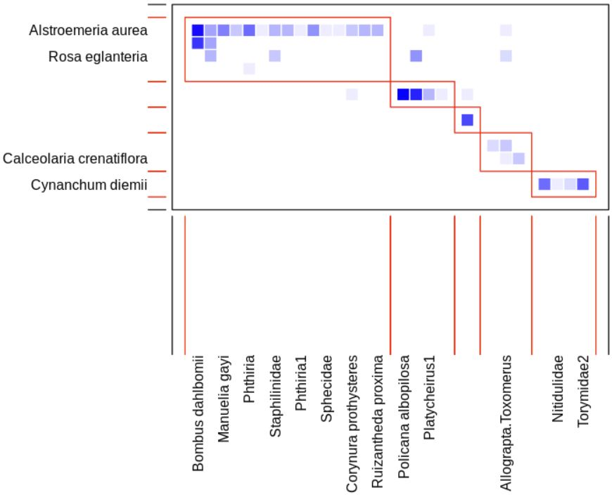

# Sesión 1: Introducción a la Teoría de Grafos

## Objetivos de la sesión 1

- Presentar una **propuesta de temario** (roadmap) para el estudio de *redes de interacción en Ecología* con el enfoque de la Teoría de Grafos.
- Motivar **por qué** el lenguaje de grafos bipartitos es natural en redes de interacción ecológicas.
- Delinear **qué haremos** en las siguientes sesiones: definiciones, cálculo computacional, interpretación y casos reales.
- Alinear expectativas sobre **productos entregables** y prácticas de reproducibilidad.

## Objetivos de la parte de Teoría de Grafos

Al finalizar esta parte del seminario, buscaremos que el grupo pueda:

1.  **Definir matemáticamente** métricas estándar en grafos bipartitos usados en ecología.
2.  **Calcular las métricas computacionalmente en R** (paquete `bipartite`), con ejemplos ilustrativos, casos extremos y redes sintéticas.
3.  **Interpretarlas en contexto matemático** (qué cuantifican, qué no cuantifican, y qué supuestos implican).
4.  **Conectar** las métricas con **redes reales** (bases de datos abiertas y datos proporcionados), y con preguntas ecológicas concretas.

## ¿Por qué grafos bipartitos en ecología de interacciones?

Muchos sistemas de interacción admiten una partición natural en dos tipos de entidades:

- plantas $\leftrightarrow$ polinizadores,
- plantas $\leftrightarrow$ dispersores,
- hospederos $\leftrightarrow$ parásitos,
- plantas $\leftrightarrow$ herbívoros, etc.

La estructura bipartita permite: \* Representar el sistema combinatoriamente y/o como una **matriz de incidencia** (binaria o ponderada). \* Cuantificar **patrones estructurales** (especialización, anidamiento, modularidad). \* Evaluar **robustez** ante perturbaciones y cambios (tiempo/espacio).

## Ejemplo: esquema de un grafo bipartito

```{tikz}
#| fig-cap: "Esquema visual de interacciones bipartitas."
#| echo: false
\usetikzlibrary{positioning,arrows,fit,backgrounds,arrows.meta}
\begin{tikzpicture}[>=Latex, node distance=0.9cm]
\tikzset{
  base/.style={circle, draw, thick, minimum size=7mm, inner sep=0pt},
  planta/.style={base, fill=green!30},
  animal/.style={base, fill=brown!40},
  lab/.style={font=\small\bfseries}
}
\node[lab] at (-2.4,2.2) {Plantas};
\node[lab] at ( 2.4,2.2) {Animales};

\node[planta] (p1) at (-2, 1.4) {$p_1$};
\node[planta] (p2) at (-2, 0.6) {$p_2$};
\node[planta] (p3) at (-2,-0.2) {$p_3$};
\node[planta] (p4) at (-2,-1.0) {$p_4$};

\node[animal] (a1) at ( 2, 1.2) {$a_1$};
\node[animal] (a2) at ( 2, 0.4) {$a_2$};
\node[animal] (a3) at ( 2,-0.4) {$a_3$};
\node[animal] (a4) at ( 2,-1.2) {$a_4$};

\draw[thick] (p1) -- (a1);
\draw[thick] (p1) -- (a2);
\draw[thick] (p2) -- (a2);
\draw[thick] (p2) -- (a3);
\draw[thick] (p3) -- (a2);
\draw[thick] (p4) -- (a4);

\node[lab, anchor=west, font=\footnotesize] at (-3.6, -2.2) {Cada arista representa una interaccion observada (o ponderada).};
\end{tikzpicture}
```

## Ejemplo: matriz bipartita

Una red bipartita puede representarse por una matriz $B\in\mathbb{R}_{\ge 0}^{p\times q}$:

$$B_{ij}=\begin{cases}0, & \text{si no se observa interacción} \\1, & \text{si se registra presencia/ausencia} \\w_{ij}>0, & \text{si se registra frecuencia/intensidad}\end{cases}$$

Ejemplo (binario): $$\begin{array}{c|cccc}   & a_1 & a_2 & a_3 & a_4\\ \hlinep_1& 1   & 1   & 0   & 0\\p_2& 0   & 1   & 1   & 0\\p_3& 0   & 1   & 0   & 0\\p_4& 0   & 0   & 0   & 1\end{array}$$

## Propuesta de temario (roadmap)

1.  **Fundamentos y datos**: redes bipartitas, matrices de incidencia, datos binarios/ponderados.
2.  **Métricas locales (por nodo/especie)**: grado/fuerza, dependencia, índices de especialización y roles.
3.  **Métricas globales (por red)**: conectancia, diversidad de interacciones, anidamiento, modularidad y estructuras mesoscópicas.
4.  **Dinámica temporal y espacial**: redes por temporada/año/sitio, recambio de enlaces, beta-diversidad de interacciones.
5.  **Robustez y perturbaciones**: extinción primaria/secundaria, curvas de robustez, sensibilidad a especies clave.
6.  **Casos de estudio + prácticas reproducibles**: datasets abiertos, ejercicios en R, reporte en Quarto y repositorio en GitHub.

## Herramienta central: `bipartite` en R

Usaremos `bipartite` como marco común de implementación:

- Cálculo de métricas a nivel red/especie.
- Visualizaciones (matriz, `plotweb`, módulos).
- Detección de modularidad en bipartitas.
- Simulaciones de extinción y coextinción.

### Ejemplo de código y visualización

```{r}
#| eval: false
#| echo: true
library(bipartite)
data(Safariland)
networklevel(Safariland, index = c("connectance","nestedness","H2"))

m <- computeModules(Safariland)
plotModuleWeb(m,
              plotModules = TRUE,
              rank = TRUE,
              weighted = TRUE,
              displayAlabels = TRUE,
              displayBlabels = TRUE,
              labsize = 0.8)
```

> **Salida esperada:** **connectance**: 0.160493827160494 **nestedness**: 19.8578346403513 **H2**: 0.853730724291418



## Conexión con datos reales (y abiertos)

Trabajaremos con redes provenientes de:

- **Datasets incluidos en `bipartite`** (para arrancar rápido).
- **Repositorios abiertos** (por ejemplo, *Web of Life*, *Mangal*).
- **Datos del grupo** (cuando se proporcionen) y redes sintéticas controladas.

Objetivo: vincular métricas con **preguntas ecológicas** concretas y con decisiones de modelado (binaria vs ponderada).

## Producto entregable: GitHub + Quarto

- notas en entorno web interactivo (definiciones, ejemplos, discusión),
- código en R (funciones y scripts),
- datasets (o instrucciones claras para descargarlos),
- figuras y salidas reproducibles.

**Meta**: que el repositorio funcione como referencia del seminario y como punto de partida para proyectos.

## ¿Qué sigue?

En las próximas sesiones avanzaremos en el siguiente orden:

1.  Notación y construcción de redes bipartitas desde datos.
2.  Métricas locales y globales: definiciones, propiedades y ejemplos.
3.  Implementación en R con `bipartite`: funciones, salidas y visualización.
4.  Interpretación y comparación; incorporación de dinámica y robustez.
5.  Casos de estudio con redes reales (y documentación).

**Sugerencia práctica**: tener instalado R/RStudio y el paquete `bipartite` antes de la siguiente sesión.

------------------------------------------------------------------------

# Fundamentos de Grafos

## ¿Qué es un grafo?

> **Definición: Grafo simple** Un **grafo simple** $G$ es un par ordenado $(V, E)$, donde: \* $V$ es un conjunto (finito, por conveniencia en este curso), cuyos elementos se llaman **vértices** (o nodos). \* $E$ es un conjunto de pares no ordenados de vértices distintos. Los elementos de $E$ se llaman **aristas** (o enlaces).

> **Ejemplo:** Sean: \* $V=\{1, 2, 3, 4\}$ \* $E=\{\{1, 2\}, \{1, 3\}, \{2, 3\}, \{3, 4\}\}$

### Terminología básica

- **Adyacencia:** Dos vértices $u, v \in V$ son **adyacentes** (o vecinos) si existe una arista que los une, es decir, si $\{u, v\} \in E$.
- **Incidencia:** Una arista $e \in E$ es **incidente** a un vértice $v \in V$ si $v$ es uno de los extremos de $e$.
- **Orden y tamaño:** El **orden** del grafo es el número de vértices, $|V|$. El **tamaño** del grafo es el número de aristas, $|E|$.

## Variaciones del concepto de grafo

No todos los sistemas se modelan con grafos simples.

- **Grafo dirigido (digrafo):** Las aristas son **pares ordenados** de vértices, $(u, v)$, representando una dirección (de $u$ a $v$). Se suelen llamar **arcos**.
- **Multigrafo:** Se permiten múltiples aristas entre el mismo par de vértices (Ej: Rutas de vuelo entre ciudades).
- **Pseudografo:** Se permiten **bucles** o lazos (aristas que conectan un vértice consigo mismo, $\{v, v\}$).
- **Grafo ponderado (o red):** A cada arista $e \in E$ se le asigna un valor numérico $w(e)$, llamado **peso** (Ej: Pesos que representan distancias entre vuelos).

### Actividad rápida: Modelado con grafos

> **Pregunta para la audiencia** En los siguientes sistemas, ¿qué representarían los vértices y las aristas?, ¿qué tipo de grafo sería el más adecuado? 1. La red de amigos en Facebook. 2. El sistema de calles de una ciudad. 3. Las dependencias entre tareas en un proyecto.

> **Solución sugerida** 1. Vértices: Personas. Aristas: Amistad (simétrica). Grafo simple (o quizás ponderado por intensidad). 2. Vértices: Intersecciones. Aristas: Calles. Grafo dirigido (si hay un sentido) y ponderado (distancia/tiempo). 3. Vértices: Tareas. Aristas: Dependencia. Grafo dirigido, acíclico.

## Subgrafos y Subgrafos inducidos

> **Definición: Subgrafo** Un grafo $H=(V_H, E_H)$ es un **subgrafo** de $G=(V_G, E_G)$ si $V_H \subseteq V_G$, $E_H \subseteq E_G$ y todas las aristas en $E_H$ tienen sus extremos en $V_H$.

> **Definición: Subgrafo inducido** Dado un subconjunto de vértices $S \subseteq V_G$, el **subgrafo inducido** por $S$, denotado $G[S]$, es el grafo $(S, E_S)$ donde $E_S$ contiene todas las aristas de $E_G$ cuyos dos extremos están en $S$.

## Isomorfismo de grafos

¿Cuándo son dos grafos "*esencialmente el mismo*"?

> **Definición: Isomorfismo** Dos grafos $G_1=(V_1, E_1)$ y $G_2=(V_2, E_2)$ son **isomorfos** ($G_1 \cong G_2$) si existe una función biyectiva $f: V_1 \to V_2$ tal que: $$\{u, v\} \in E_1 \Leftrightarrow \{f(u), f(v)\} \in E_2$$ La función $f$ preserva la adyacencia.

## Grado de un vértice

> **Definición: Grado** El **grado** de un vértice $v$ en un grafo $G$, denotado $\deg(v)$ o $d(v)$, es el número de aristas incidentes a $v$. Equivalentemente, es el número de vecinos de $v$.

> **Teorema: Lema del apretón de manos** Para cualquier grafo $G=(V, E)$, la suma de los grados de todos los vértices es igual al doble del número de aristas: $$\sum_{v \in V} \deg(v) = 2|E|$$ *Idea de la demostración:* Cada arista $\{u, v\}$ contribuye exactamente dos veces a la suma total de grados.

### Actividad rápida: Lema del apretón de manos

> **Ejercicio** ¿Es posible construir un grafo simple con 5 vértices que tengan los siguientes grados: 3, 3, 3, 1, 0?

> **Solución** Calculamos la suma de los grados: $3+3+3+1+0 = 10$. Según el Lema del apretón de manos, la suma debe ser $2|E|$. Como $10$ es par, el lema se cumple ($|E|=5$). Sin embargo, cumplir el lema no garantiza la existencia del grafo. Un vértice tiene grado 0 (aislado). En el subgrafo restante de 4 vértices, los grados deben ser 3, 3, 3, 1. Si tres vértices tienen grado 3 en un grafo de 4, todos deben estar conectados a todos, lo que obliga al cuarto vértice a tener grado 3, contradiciendo que debe tener grado 1. **No es posible.**

## Caminos, ciclos y conectividad

- **Camino (simple):** Sucesión de vértices distintos $v_0, v_1, \dots, v_k$ tal que $\{v_{i-1}, v_i\}$ es una arista para todo $i$. Longitud = $k$.
- **Ciclo (simple):** Un camino con $k \geq 3$ donde el primer y último vértice son el mismo ($v_0=v_k$).
- **Conectividad:** Un grafo es **conexo** si existe un camino entre cualquier par de vértices distintos.
- **Componente conexa:** Subgrafo maximal conexo.

## Representaciones de grafos

### Lista de adyacencia

Para cada vértice, almacenamos una lista de sus vecinos. \* **Ventaja:** Eficiente en memoria para grafos **esparsos** (pocos enlaces). \* **Desventaja:** Verificar existencia de una arista toma tiempo.

### Matriz de adyacencia

> **Definición:** Sea $G=(V, E)$ con $|V|=n$. La matriz $A$ de $n \times n$ donde: $$A_{ij} = \begin{cases} 1 & \text{si } \{i, j\} \in E \\ 0 & \text{en otro caso} \end{cases}$$

### Matriz de incidencia

> **Definición:** Sea $G=(V, E)$ con $|V|=n$ y $|E|=m$. La matriz $B$ de $n \times m$ donde: $$B_{ie} = \begin{cases} 1 & \text{si el vértice } i \text{ es incidente a la arista } e \\ 0 & \text{en otro caso} \end{cases}$$

### El Laplaciano del grafo

Se define con la matriz de grados $D$ (diagonal con $D_{ii} = \deg(i)$).

> **Definición: Matriz Laplaciana** $$L = D - A$$

> **Propiedades espectrales de L:** 1. $L$ es simétrica. 2. $L$ es **semidefinida positiva** ($\lambda_i \geq 0$). 3. Siempre $\lambda_1=0$. La multiplicidad del autovalor 0 es igual al número de componentes conexas del grafo $G$.

------------------------------------------------------------------------

# Árboles y Conectividad

## Estructura básica: Árboles

> **Definición: Árbol y bosque** Un **árbol** es un grafo conexo y acíclico. Un **bosque** es un grafo acíclico (sus componentes conexas son árboles).

> **Teorema de caracterización:** Sea $G=(V, E)$ un grafo con $n$ vértices. Son equivalentes: 1. $G$ es un árbol. 2. $G$ es conexo y tiene exactamente $n-1$ aristas. 3. $G$ es acíclico y tiene exactamente $n-1$ aristas. 4. Existe un **único** camino entre cualquier par de vértices. 5. $G$ es mínimamente conexo. 6. $G$ es máximamente acíclico.

### Actividad rápida: Identificar árboles

> **Ejercicio:** ¿Cuáles de los siguientes grafos son árboles? \* **G1:** $V=\{1..5\}$, $E=\{\{1,2\}, \{2,3\}, \{3,4\}, \{4,5\}\}$ \* **G2:** $V=\{1..5\}$, $E=\{\{1,2\}, \{2,3\}, \{3,4\}, \{4,5\}, \{5,1\}\}$ \* **G3:** $V=\{1..5\}$, $E=\{\{1,2\}, \{2,3\}, \{3,1\}, \{3,4\}, \{4,5\}\}$ \* **G4:** $V=\{1..6\}$, $E=\{\{1,2\}, \{2,3\}, \{4,5\}\}$

> **Solución:** \* [**G1:**]{style="color:#003399;"} **Sí es un árbol**. \* [**G2:**]{style="color:#003399;"} **No es un árbol** (contiene ciclo). \* [**G3:**]{style="color:#003399;"} **No es un árbol** (grafo con $n$ vértices y $n$ aristas siempre tiene ciclo). \* [**G4:**]{style="color:#003399;"} **No es un árbol** (es un bosque desconectado).

## Cortes y puentes

- **Puente:** Arista cuya eliminación desconecta el grafo.
- **Vértice de corte:** Vértice cuya eliminación aumenta las componentes conexas.

> **Teorema de Menger (versión vértices)** El número mínimo de vértices que se deben eliminar para separar $u$ de $v$ es igual al número máximo de caminos internamente disjuntos entre $u$ y $v$.

------------------------------------------------------------------------

# Métricas y Análisis de Redes

## Centralidad

Medidas para cuantificar la "importancia" de un nodo.

1.  **Centralidad de grado:** Popularidad inmediata. $C_D(v) = \deg(v)$.
2.  **Centralidad de cercanía (Closeness):** Inverso de la distancia promedio a los demás. $$C_C(v) = \frac{1}{\sum_{u \neq v} d(v, u)}$$
3.  **Centralidad de intermediación (Betweenness):** Frecuencia con la que actúa como puente en caminos más cortos. $$C_B(v) = \sum_{s \neq v \neq t} \frac{\sigma_{st}(v)}{\sigma_{st}}$$
4.  **Centralidad de vector propio:** Ecuación de autovalores de la matriz de adyacencia $A\mathbf{x} = \lambda\mathbf{x}$.

## Coeficiente de agrupamiento (Clustering)

> **Coeficiente de agrupamiento local:** Fracción de vecinos de $v$ que están conectados entre sí. $$C(v) = \frac{\text{Número de triángulos que incluyen a } v}{\text{Número de posibles triángulos centrados en } v}$$

## Detección de comunidades y modularidad

> **Modularidad (Q):** $$Q = \frac{1}{2m} \sum_{i,j} \left[ A_{ij} - \frac{k_i k_j}{2m} \right] \delta(c_i, c_j)$$ Valores altos indican una fuerte estructura de comunidad.

------------------------------------------------------------------------

# Grafos Bipartitos y Emparejamientos

> **Definición: Grafo bipartito** Un grafo $G=(V, E)$ es **bipartito** si $V$ puede dividirse en $V_1$ y $V_2$ disjuntos tal que toda arista conecta $V_1$ con $V_2$. No hay aristas internas en los conjuntos.

> **Teorema:** Un grafo es bipartito si y sólo si no contiene ciclos de longitud impar.

> **Representación Matricial:** $$A = \begin{pmatrix}\mathbf{0} & B \\B^T & \mathbf{0}\end{pmatrix}$$ Donde $B$ es la matriz de **biadyacencia**.

## Emparejamientos (Matchings)

- **Emparejamiento:** Subconjunto de aristas que no comparten vértices.
- **Emparejamiento perfecto:** Cubre todos los vértices del grafo.

> **Teorema de Hall:** Sea $G=(V_1 \cup V_2, E)$ un grafo bipartito. Existe un emparejamiento que cubre todos los vértices de $V_1$ si y sólo si para todo subconjunto $S \subseteq V_1$: $$|N(S)| \geq |S|$$

------------------------------------------------------------------------

# Bibliografía General Recomendada

### Fundamentos de grafos bipartitos

- **Asratian, A. S., Denley, T. M. J., & Häggkvist, R. (1998).** *Bipartite Graphs and their Applications*. Cambridge University Press.
- **Hall, P. (1935).** “On Representatives of Subsets.” *Journal of the London Mathematical Society*, 10(1), 26–30.
- **Bondy, J. A., & Murty, U. S. R. (1976).** *Graph Theory with Applications*. London: Macmillan.
- **Lovász, L., & Plummer, M. D. (1986).** *Matching Theory*. North-Holland.
- **Wasserman, S., & Faust, K. (1994).** *Social Network Analysis: Methods and Applications*. Cambridge University Press.

### Métricas y propiedades estructurales en grafos bipartitos

- **Latapy, M., Magnien, C., & Del Vecchio, N. (2008).** “Basic Notions for the Analysis of Large Two-Mode Networks.” *Social Networks*, 30(1), 31–48.
- **Borgatti, S. P., & Everett, M. G. (1997).** “Network Analysis of 2-Mode Data.” *Social Networks*, 19(3), 243–269.
- **Dormann, C. F., et al. (2009).** “Indices, Graphs and Null Models: Analyzing Bipartite Ecological Networks.” *The Open Ecology Journal*, 2, 7–24.
- **Almeida-Neto, M., et al. (2008).** “A Consistent Metric for Nestedness Analysis in Ecological Systems: Reconciling Concept and Measurement.” *Oikos*, 117(8), 1227–1239.
- **Barber, M. J. (2007).** “Modularity and Community Detection in Bipartite Networks.” *Physical Review E*, 76(6), 066102.
- **Ouadah, S., Latouche, P., & Robin, S. (2022).** “Motif-Based Tests for Bipartite Networks.” *Electronic Journal of Statistics*, 16(1), 293–330.
- **Borgatti, S. P., & Everett, M. G. (1999).** “Models of Core/Periphery Structures.” *Social Networks*, 21(4), 375–395.

### Modelos y métricas generalizables a redes bipartitas

- **Kunegis, J. (2015).** “Exploiting the Structure of Bipartite Graphs for Algebraic and Spectral Graph Theory Applications.” *Internet Mathematics*, 11(4), 201–231.
- **Saracco, F., et al. (2015).** “Randomizing Bipartite Networks: The Case of the World Trade Web.” *Scientific Reports*, 5, 10595.
- **Cimini, G., et al. (2019).** “The Statistical Physics of Real-World Networks.” *Nature Reviews Physics*, 1(1), 58–71.
